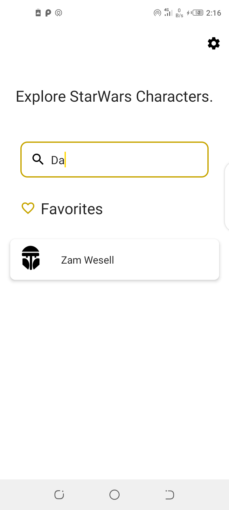
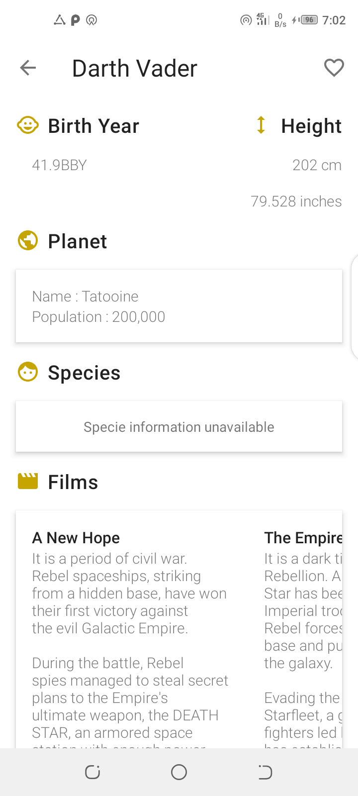
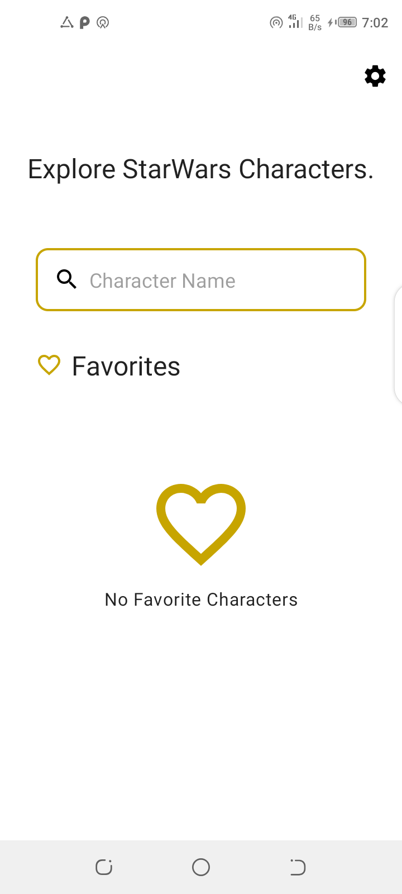
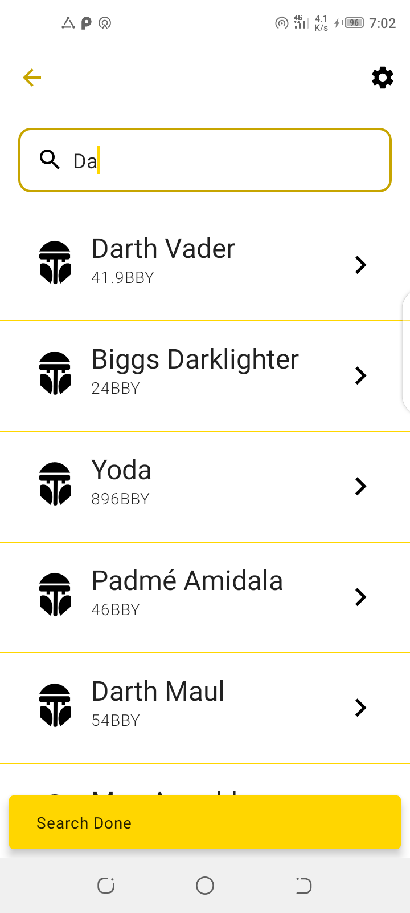

# Clean Architecture App

An Android app consuming [a Star Wars API](https://swapi.dev/) to display Movie Characters
it has been built with clean architecture principles, Repository Pattern and MVVM
pattern with unit testing.

## Architecture

The Application is split into a three layer architecture:
- Presentation
- Domain
- Data


This provides better abstractions between framework implementations 
and the underlying business logic.It requires a number of classes to get 
things running but the pros outweigh the cons in terms of building an app 
that should scale.

The 3 layered architectural approach is majorly guided by clean architecture which provides
a clear separation of concerns with its Abstraction Principle.

#### Presentation

```app``` contains the UI files and handles binding of DI components from other modules.
Binding of data is facilitated by jetpacks data binding by serving data from the viewmodel
to the UI.The data being received is part of a viewstate class that has properties contained in the
relevant state.

#### Domain

The ```domain``` module contains domain model classes which represent the
data we will be handling across presentation and data layer.

Use cases are also provided in the domain layer and orchestrate the flow 
of data from the data layer onto the presentation layer and a split into
modular pieces serving one particular purpose.

The UseCases use a ```BaseUseCase``` interface that defines the parameters its taking in and 
output this helps in creating fakes using in testing.

#### Data

- ```data-remote```

Handles data interacting with the network and is later serverd up to the presentation layer through 
domain object

- ```data-local```

Handles persistence of object with Room ORM from.This module is responsible for handling all local related
logic and serves up data to and from the presentation layer through domain objects.

With this separation we can easily swap in new or replace the database being used without causeing
major ripples across the codebase.

## Testing

Each module has its own tests except for the ```domain``` module which is catered for since its
part of the behavior under test.

All server responses in the tests are served by mock web server by appending relative urls to
the localhost and the connected port as the base url.

In the ``data-remote`` module the responses are mocked using the mockwebserver and verified that they
are what we expect.

In the ```data-local``` module an in  memory database is being used to run the tests,this makes it a
little faster compared to an actual db.

In the ```app``` module there are unit tests for the viewmodels and util classes 
and connected tests for the UI Screens.

The test instrumentation app uses modules that have been swaped with fakes for
the network module so as to run requests on localhost with mockwebserver,this removes flakiness 
compared to relying on actual  data from the real server aspects such as internet connection or
network service might bring up issues and an in memory database for local data that also allows 
main thread queries since tests should also be fast and we are just asserting stuff works.

View models testing on live data were guided by this [article](https://proandroiddev.com/how-to-easily-test-a-viewmodel-with-livedata-and-coroutines-230c74416047)

## Screenshots

| | | ||
|:----:|:----:|:----:|:----:|

||
|:----:|